<div align="center">



<br/>

<a href="https://mruil.github.io"></a>
<a href="https://scholar.google.com/citations?user=Fgh4hTUAAAAJ"></a>
<a href="mailto:yang.9.liu@kcl.ac.uk"></a>


<br/><br/>


</div>

<br/>

## `>_ whoami`

```python
class YangLiu(Researcher):
    education   = ["PhD, King's College London — School of Biomedical Engineering & Imaging Sciences (2021–2026)",
                   "MSc, Huazhong University of Science and Technology (2019–2021), advised by Prof. Xiang Bai"]
    experience  = ["Proximie — Data Scientist, part-time (Jan–Jul 2025)",
                   "ByteDance — Computer Vision Algorithm Engineer, intern (2021)"]
    advisors    = {"primary": "Prof. Sébastien Ourselin", "co-supervisors": ["Prof. Prokar Dasgupta", "Dr. Alejandro Granados"]}

    research    = {
        "surgical video":   ["online phase recognition", "long-video transformers", "streaming VLMs"],
        "segmentation":     ["weakly-supervised referring segmentation", "unsupervised instrument segmentation"],
        "medical imaging":  ["echocardiography phase detection", "stroke lesion segmentation", "AD diagnosis from sMRI"],
        "vision-language":  ["language-driven visual tasks", "noise-injected cross-modal alignment"],
    }

    def mission(self):
        return "Build AI that watches surgery in real time and makes the operating room safer."
```

<br/>

## `>_ research highlights`

<table>
<tr>
<td width="50%" valign="top">

### 🩺 Surgical Video Understanding
Online, causal recognition of what is happening in the OR — from a single frame to a multi-hour procedure.

- **StableSPR** · MICCAI 2026 *(early accept, top 9%)* — temporal error-cascade loss + evidence-gated transition predictor for stable online phase recognition
- **LoViT** · Medical Image Analysis 2024 — long video transformer for surgical phase recognition
- **SKiT** · ICCV 2023 — fast key-information video transformer, real-time online inference
- **Motion-boundary unsupervised instrument segmentation** · MICCAI 2025

</td>
<td width="50%" valign="top">

### 🧠 Vision-Language & Segmentation
Learning with fewer labels, across modalities.

- **WeakMCN** · CVPR 2025 — multi-task collaborative network for weakly-supervised referring expression comprehension & segmentation
- **ArcSin** · language-driven visual tasks via adaptive-ranged cosine similarity noise injection
- **Super-BPD** · CVPR 2020 — boundary-to-pixel direction for fast image segmentation (~25 fps)
- **WDNet** · WACV 2021 — watermark-decomposition network + the CLWD dataset

</td>
</tr>
</table>

<div align="center">

🏆 **1st place** — MICCAI 2022 ATLAS Ischemic Stroke Lesion Segmentation Challenge (Team CTRL)

</div>

<br/>

## `>_ publications`

| Year | Venue | Paper | Links |
|:---:|:---:|---|:---:|
| 2026 |  | **Stabilizing Temporal Inference Dynamics for Online Surgical Phase Recognition** — Yang Liu\*, Ning Zhu\*, J. Peng, X. Chen, A. Granados, G. Wang, S. Ourselin | [arXiv](https://arxiv.org/abs/2605.16387) · [code](https://github.com/MRUIL/StableSPR) |
| 2026 |  | **SLIM: High-Throughput Watermarking with Stationary Latent Manifolds** — Q. Yan, Z. Chen, Yang Liu†, Z. Cai† | — |
| 2025 |  | **Motion-Boundary-Driven Unsupervised Surgical Instrument Segmentation in Low-Quality Optical Flow** — Yang Liu, P. Wu, J. Huo, G. Zhang, Z. Yuan, C. Bergeles, R. Sparks, P. Dasgupta, A. Granados, S. Ourselin | [arXiv](https://arxiv.org/abs/2403.10039) |
| 2025 |  | **WeakMCN: Multi-task Collaborative Network for Weakly Supervised Referring Expression Comprehension and Segmentation** — Yang Liu\*, Silin Cheng\*, X. He, S. Ourselin, L. Tan, G. Luo | [arXiv](https://arxiv.org/abs/2505.18686) · [code](https://github.com/MRUIL/WeakMCN) |
| 2025 |  | **A Domain Generalization Framework Based on Wavelet-Driven Structural Enhancement and Contrastive Alignment** — Y. Xu, T. Zhang, Yang Liu | — |
| 2024 |  | **LoViT: Long Video Transformer for Surgical Phase Recognition** — Yang Liu, M. Boels, L. C. Garcia-Peraza-Herrera, T. Vercauteren, P. Dasgupta, A. Granados, S. Ourselin | [paper](https://www.sciencedirect.com/science/article/pii/S1361841524002913) · [code](https://github.com/MRUIL/LoViT) |
| 2024 |  | **Gray Matter-Guided Attention Network for AD Diagnosis Using Structural MRI** — Y. Zhang, H. Cai, Y. Du, B. Xu, Yang Liu† | [paper](https://ieeexplore.ieee.org/abstract/document/10635472) |
| 2024 |  | **DDSB: An Unsupervised and Training-free Method for Phase Detection in Echocardiography** — Z. Bu\*, Yang Liu\*†, et al. | [arXiv](https://arxiv.org/abs/2403.12787) · [code](https://github.com/MRUIL/DDSB) |
| 2024 |  | **ArcSin: Adaptive ranged cosine Similarity injected noise for Language-Driven Visual Tasks** — Yang Liu, X. Yu, G. Zhang, Z. Zhu, C. Bergeles, P. Dasgupta, A. Granados, S. Ourselin | [arXiv](https://arxiv.org/abs/2402.17298) |
| 2023 |  | **SKiT: a Fast Key Information Video Transformer for Online Surgical Phase Recognition** — Yang Liu, J. Huo, J. Peng, R. Sparks, P. Dasgupta, A. Granados, S. Ourselin | [paper](https://openaccess.thecvf.com/content/ICCV2023/html/Liu_SKiT_a_Fast_Key_Information_Video_Transformer_for_Online_Surgical_ICCV_2023_paper.html) · [repo](https://github.com/MRUIL/SKiT) |
| 2021 |  | **WDNet: Watermark-Decomposition Network for Visible Watermark Removal** — Yang Liu, Z. Zhu, X. Bai | [paper](https://openaccess.thecvf.com/content/WACV2021/papers/Liu_WDNet_Watermark-Decomposition_Network_for_Visible_Watermark_Removal_WACV_2021_paper.pdf) · [code](https://github.com/MRUIL/WDNet) |
| 2020 |  | **Super-BPD: Super Boundary-to-Pixel Direction for Fast Image Segmentation** — J. Wan, Yang Liu, D. Wei, X. Bai, Y. Xu | [paper](https://openaccess.thecvf.com/content_CVPR_2020/papers/Wan_Super-BPD_Super_Boundary-to-Pixel_Direction_for_Fast_Image_Segmentation_CVPR_2020_paper.pdf) · [code](https://github.com/JianqiangWan/Super-BPD) |

<sub>\* equal contribution &nbsp;·&nbsp; † corresponding author</sub>

<br/>

## `>_ featured repositories`

<div align="center">

<a href="https://github.com/MRUIL/WDNet"></a>
<a href="https://github.com/MRUIL/WeakMCN"></a>
<a href="https://github.com/MRUIL/LoViT"></a>
<a href="https://github.com/MRUIL/StableSPR"></a>

</div>

<br/>

## `>_ tech stack`

<div align="center">

**Deep Learning**<br/>


**Vision · Medical · Multimodal**<br/>


**Infra · Tooling**<br/>


</div>

<br/>

## `>_ github analytics`

<div align="center">


<br/>


<br/><br/>


<br/><br/>


<br/><br/>

<picture>
  <source media="(prefers-color-scheme: dark)" srcset="https://raw.githubusercontent.com/MRUIL/MRUIL/output/github-snake-dark.svg" />
  <source media="(prefers-color-scheme: light)" srcset="https://raw.githubusercontent.com/MRUIL/MRUIL/output/github-snake.svg" />
  
</picture>

</div>

<br/>

## `>_ timeline`

```text
2026.05  ◆ MICCAI 2026 early accept (top 9%) — StableSPR          ◆ IEEE TCSVT — SLIM
2026.01  ◆ PhD awarded, King's College London
2025     ◆ CVPR 2025 — WeakMCN   ◆ MICCAI 2025   ◆ ICME 2025   ◆ Data Scientist @ Proximie (Jan–Jul)
2024     ◆ Medical Image Analysis — LoViT   ◆ ISBI 2024   ◆ DDSB / ArcSin preprints
2023     ◆ ICCV 2023 — SKiT
2022     ◆ 1st place, MICCAI ATLAS Stroke Lesion Segmentation Challenge
2021     ◆ MSc, HUST   ◆ CV Algorithm Engineer intern @ ByteDance   ◆ PhD begins @ KCL, London  
2020–21  ◆ CVPR 2020 — Super-BPD   ◆ WACV 2021 — WDNet
```

<br/>

<div align="center">

**Open to collaboration on surgical AI, medical video understanding and vision-language models.**<br/>
<sub>yang.9.liu@kcl.ac.uk</sub>

<br/><br/>


</div>
